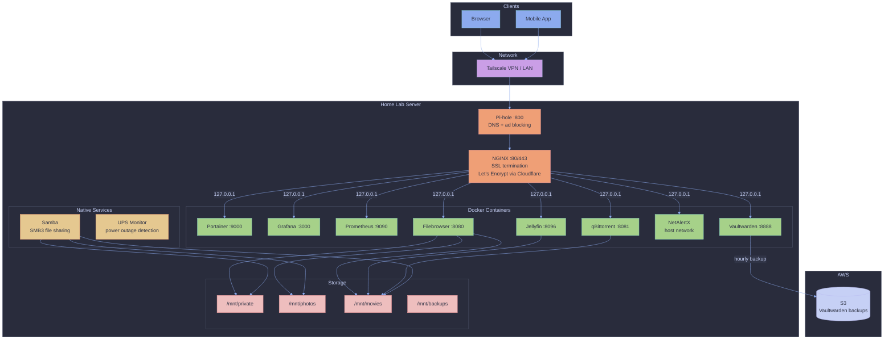

# 🧪 home-lab-ansible

Ansible automation for provisioning and configuring a single-node Ubuntu home lab server. Manages Docker containers, networking, storage, security, monitoring, and media services under the `arcade-lab.io` domain.

## Architecture

All services run on a single Ubuntu server. Docker containers are bound exclusively to `127.0.0.1` and exposed through an NGINX reverse proxy with SSL termination. Remote access is provided via Tailscale VPN with subnet routing, and Pi-hole handles local DNS resolution for all subdomains.

```
Internet / Tailscale VPN
         │
    ┌────▼─────┐
    │  NGINX   │  (reverse proxy, SSL)
    │  :80/443 │
    └────┬─────┘
         │  127.0.0.1
         ├──► Pi-hole        (:800)    DNS + ad blocking
         ├──► Portainer      (:9000)   container management
         ├──► Grafana        (:3000)   dashboards
         ├──► Prometheus     (:9090)   metrics
         ├──► qBittorrent    (:8081)   torrent client
         ├──► Filebrowser    (:8080)   web file manager
         ├──► Jellyfin       (:8096)   media server
         ├──► NetAlertX      (host)    network scanner
         └──► Vaultwarden    (:8888)   password manager
```



## Services

| Service | Type | Subdomain | Description |
|---|---|---|---|
| **Pi-hole** | Docker | `pi-hole.arcade-lab.io` | DNS server with ad blocking and local DNS records |
| **Portainer** | Docker | `portainer.arcade-lab.io` | Docker container management UI |
| **Grafana** | Docker | `grafana.arcade-lab.io` | Monitoring dashboards |
| **Prometheus** | Docker | `prometheus.arcade-lab.io` | Metrics collection |
| **qBittorrent** | Docker | `qbittorrent.arcade-lab.io` | BitTorrent client |
| **Filebrowser** | Docker | `filebrowser.arcade-lab.io` | Web-based file manager for movies, photos, and private storage |
| **Jellyfin** | Docker | `jellyfin.arcade-lab.io` | Media server (4GB RAM, 4 CPU limit) |
| **NetAlertX** | Docker | `netalertx.arcade-lab.io` | Network scanner and alerter (host network mode) |
| **Vaultwarden** | Docker | `vaultwarden.arcade-lab.io` | Self-hosted Bitwarden-compatible password manager |
| **NGINX** | Native | — | Reverse proxy with SSL for all services |
| **Samba** | Native | — | SMB3 file sharing (3 shares: private, photos, movies) |
| **Tailscale** | Native | — | VPN with subnet routing for remote access |
| **UPS Monitor** | Native | — | Router ping-based power outage detection with graceful shutdown |

## Project Structure

```
├── ansible.cfg              # Ansible configuration
├── config/                  # Jinja2 templates
│   ├── cloudflare.ini.j2    # Certbot Cloudflare DNS credentials
│   ├── nginx.conf.j2        # NGINX reverse proxy virtual hosts
│   ├── smb.conf.j2          # Samba shares configuration
│   └── ssh.j2               # Hardened sshd_config
├── docs/                    # Documentation
│   └── tailscale.md         # Tailscale subnet routing architecture
├── inventory/
│   └── hosts.ini            # Single-host inventory
├── playbooks/               # Service playbooks
│   ├── main.yml             # Master orchestrator
│   ├── backup.yml           # Photo backup with rotation + daily restart cron
│   ├── backup-vaultwarden.yml # Vaultwarden S3 backup setup (AWS CLI, script, cron)
│   ├── cloudwatch-agent.yml  # CloudWatch heartbeat agent for DR failover detection
│   ├── docker.yml           # Docker CE installation
│   ├── filebrowser.yml      # Filebrowser container
│   ├── jellyfin.yml         # Jellyfin media server container
│   ├── monitoring.yml       # Prometheus/Grafana stack
│   ├── netalertx.yml        # NetAlertX network scanner container
│   ├── nginx.yml            # NGINX reverse proxy + SSL
│   ├── pihole.yml           # Pi-hole DNS container
│   ├── portainer.yml        # Portainer container
│   ├── samba.yml            # Samba file sharing
│   ├── ssh.yml              # SSH hardening
│   ├── tailscale.yml        # Tailscale VPN
│   ├── qbittorrent.yml      # qBittorrent container
│   ├── vaultwarden.yml      # Vaultwarden password manager container
│   ├── ufw.yml              # UFW firewall rules
│   ├── update.yml           # System updates
│   ├── update-images.yml    # Pull latest container images and recreate
│   ├── ups-monitor.yml      # UPS power outage monitor
│   └── volumes.yml          # Disk mounts via fstab
├── scripts/
│   └── wait_for_network.sh  # Network readiness check for Docker
├── terraform/               # AWS infrastructure (S3, IAM)
│   ├── versions.tf          # Terraform + provider versions, S3 backend
│   ├── provider.tf          # AWS provider (SSO profile)
│   ├── variables.tf         # Input variables
│   ├── outputs.tf           # Bucket names, access keys
│   ├── s3.tf                # Terraform state bucket + Vaultwarden backup bucket
│   ├── iam.tf               # IAM user, policy, access key for backups
│   └── vaultwarden-dr/      # DR failover infrastructure
│       ├── cloudwatch.tf    # Failure + recovery alarms
│       ├── ec2.tf           # Launch template (spot) + security group
│       ├── iam.tf           # Lambda role, EC2 instance profile
│       ├── lambda.tf        # Function + SNS trigger
│       ├── lambda/failover.py # Lambda handler (failover + teardown)
│       ├── sns.tf           # Alarm + notification topics
│       ├── ssm.tf           # Tailscale API key, Discord webhook, Cloudflare token
│       └── variables.tf     # Input variables
├── tasks/                   # Reusable task files
│   ├── generate-password.yml
│   ├── reset-docker.yml
│   ├── restart.yml
│   └── update-packages.yml
└── vars/                    # Variables (gitignored, contains secrets)
    ├── certbot.yml
    ├── filebrowser.yml
    ├── fstab.yml
    ├── containers.yml       # Container names and image tags (shared by all service playbooks)
    ├── jellyfin.yml
    ├── netalertx.yml
    ├── pihole.yml
    ├── portainer.yml
    ├── ssh.yml
    ├── tailscale.yml
    ├── qbittorrent.yml
    ├── cloudwatch.yml
    ├── vaultwarden.yml
    └── ups-monitor.yml
```

## Prerequisites

- Ansible installed on the control machine
- SSH access to the target server (public key authentication)
- A `vars/` directory populated with the required variable files (see [Variables](#variables))

## Usage

### Full provisioning

Run the master playbook to provision everything in the correct order:

```bash
ansible-playbook playbooks/main.yml
```

The master playbook executes in this order: system updates, volume mounts, Samba, Docker, NGINX, SSH hardening, UFW firewall, qBittorrent, Filebrowser, backup, monitoring, and Portainer.

### Individual services

Run any service playbook independently:

```bash
ansible-playbook playbooks/pihole.yml
ansible-playbook playbooks/jellyfin.yml
ansible-playbook playbooks/netalertx.yml
ansible-playbook playbooks/tailscale.yml
ansible-playbook playbooks/vaultwarden.yml
ansible-playbook playbooks/ups-monitor.yml
ansible-playbook playbooks/backup-vaultwarden.yml
ansible-playbook playbooks/cloudwatch-agent.yml
```

> **Note:** Pi-hole, Jellyfin, NetAlertX, Tailscale, Vaultwarden, UPS Monitor, Vaultwarden backup, and CloudWatch agent are not included in `main.yml` and must be run separately.

### Utility tasks

```bash
# Restart the server
ansible-playbook tasks/restart.yml

# Full Docker cleanup (removes all containers, volumes, networks, images)
ansible-playbook tasks/reset-docker.yml
```

## Variables

All variable files live in `vars/` and are gitignored to protect secrets. You need to create these files before running the playbooks:

| File | Required Variables |
|---|---|
| `vars/certbot.yml` | Cloudflare email, API token |
| `vars/fstab.yml` | Disk UUIDs and mount points |
| `vars/ssh.yml` | SSH port, auth settings, timeouts |
| `vars/tailscale.yml` | Auth key, advertised routes |
| `vars/containers.yml` | Container names and image tags for all Docker services |
| `vars/pihole.yml` | DNS config, local DNS records, ports |
| `vars/jellyfin.yml` | Timezone, paths, resource limits |
| `vars/netalertx.yml` | Port, timezone, data path |
| `vars/qbittorrent.yml` | Ports, paths, timezone |
| `vars/filebrowser.yml` | Paths |
| `vars/portainer.yml` | Data path |
| `vars/vaultwarden.yml` | Data path, port, AWS credentials, S3 bucket/region |
| `vars/cloudwatch.yml` | Namespace, metric name, heartbeat interval |
| `vars/ups-monitor.yml` | Router IP for ping monitoring |

## Security

- **SSH:** Non-standard port, public key authentication only, root login disabled, restricted user access
- **Firewall (UFW):** Default deny incoming; allows only SSH, SMB, HTTP/HTTPS, and Tailscale traffic
- **Containers:** All bound to `127.0.0.1`, accessible only through the NGINX reverse proxy
- **Samba:** SMB3-only, restricted to LAN and Tailscale subnets
- **Remote access:** Tailscale VPN with tag-based ACLs
- **Secrets:** Variable files are gitignored rather than vault-encrypted

## Storage

Four ext4 partitions are mounted via fstab (by UUID):

| Mount Point | Purpose |
|---|---|
| `/mnt/private` | Private files (Samba + Filebrowser) |
| `/mnt/photos` | Photo storage (Samba + Filebrowser + backup source) |
| `/mnt/movies` | Media library (Samba + Filebrowser + Jellyfin + qBittorrent) |
| `/mnt/backups` | Backup destination (rsync with 3-backup rotation) |

## Backup

**Photo backup:** A daily cron job (1:00 AM) runs `rsync` to back up `/mnt/photos` to `/mnt/backups` with timestamp-based rotation, keeping the last 3 backups. The server is also configured to restart daily at 3:00 AM.

**Vaultwarden backup:** An hourly cron job creates a consistent SQLite backup using `sqlite3 .backup` on the host, archives the full data directory, and uploads it to S3. Old backups are automatically expired by a 3-day S3 lifecycle rule (~72 restore points). AWS infrastructure (S3 bucket, IAM user, policy) is managed via Terraform in `terraform/`.

**Vaultwarden DR failover:** A CloudWatch heartbeat agent sends a custom metric every 60 seconds. If heartbeats stop for ~5 minutes, a CloudWatch alarm triggers a Lambda function that launches an EC2 spot instance, restores the latest S3 backup, connects to Tailscale, obtains a Let's Encrypt certificate via Cloudflare DNS-01 challenge, updates the DNS record to the Tailscale IP, and serves Vaultwarden behind nginx with TLS at `https://vaultwarden-dr.arcade-lab.io`. When heartbeats resume for 10 consecutive minutes, the failover instance is automatically terminated. Infrastructure is managed via Terraform in `terraform/vaultwarden-dr/`.

## Monitoring

The Prometheus and Grafana stack is managed via a separate repository ([home-lab-monitoring](https://github.com/denesbeck/home-lab-monitoring)) which is cloned and started with `docker compose`. The UPS monitor script exports power metrics to Prometheus via the node_exporter textfile collector.
